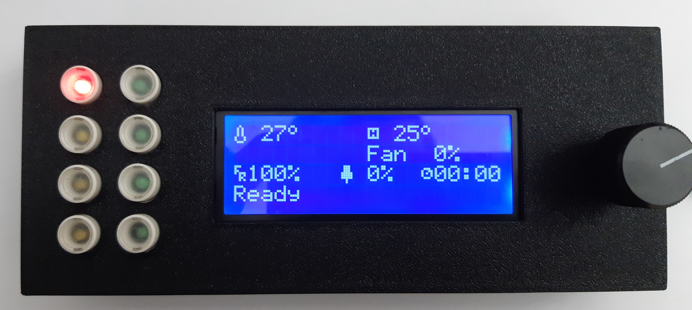

>  **DISCLAIMER:**
>   This project project is made by an hobbyist.
>   Everything described here is without guarantee, so if you perform something described here, **YOU DO IT ON YOUR OWN RISK**
>
ASCII Display for Klipper
=========================

This project contains the ASCII Display that I use with Klipper.

It's controlled by a Rotary Encoder and few Buttons and controllable LEDs.

Features:
* Raspberry Pi Pico for easy klipper integration
* 20x4 LCD
  * Controlled by rotary encoder with push button
  * Background LED brightness controllable from klipper
* 8 Pushbuttons for custom actions in klipper
* 7 LEDs triggerable from klipper.
* Single MicroUSB cable for connection to klipper host machine.

See [General](doc/General.md) for details.

KiCAD Projects
--------------
Two KiCAD projects can be found.

* _RPiPicoKlipperAsciiHMI_
  * Schematics I used on my breadboard during "proof of concept" phase.
* _RPiPicoAsciiHMI2_
  * [Schematics](https://github.com/seho85/RaspberryPicoKlipperHMI/raw/master/RPiPicoAsciiHMI2/Schematic.pdf)) for the HMI that I use with klipper.

See [KiCAD Projects](doc/KiCAD_Projects.md)

PCBs
----
Basically the whole HMI consists of two PCBs.

* The [Button PCB](doc/BTN_LED_PCB.md)
    * Buttons (with integrated LEDs)
* The [Main PCB](doc/Main_PCB.md)
  * all other components.

FreeCAD Projects
----------------
In the _FreeCAD_ folder two FreeCAD Projects for the case and the backcover can be found.

Hardware used
-------------
The major components used for the HMI can be found here [Hardware Listing](doc/Hardware.md)

For a complete listing of all the components please refer to the KiCAD Project.

MicroPython
-----------
During the creation process of the HMI I created a few MicroPython scripts to test a components.

See [MicroPython Testing Script](doc/MicroPython.md)

Klipper Configuration
---------------------
See [Klipper Config](doc/klipper_config.md)

How to Flash Raspberry Pi Pico
------------------------------
See [Flashing](doc/Flashing.md)