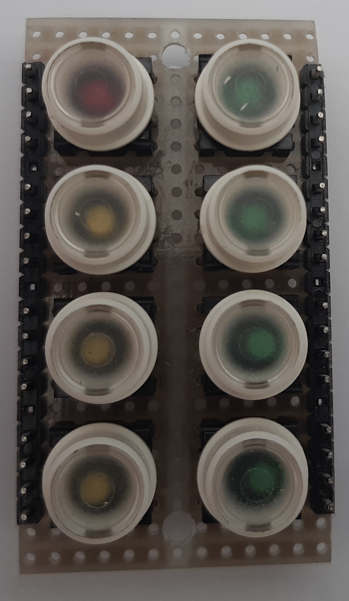
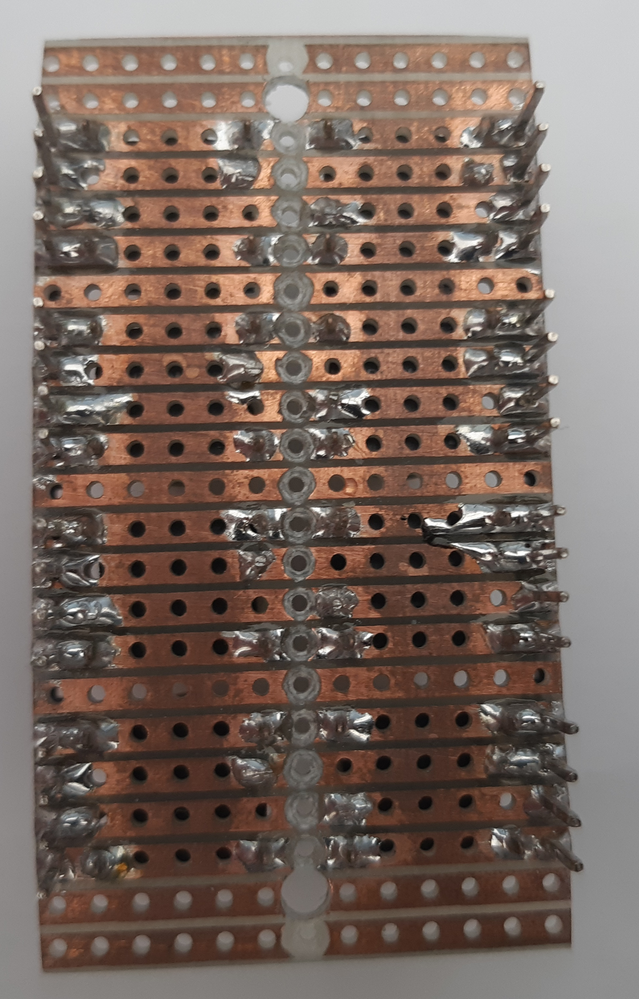

Button + LED PCB
================

The push buttons with integrated LEDs are placed on a seperate PCB which is connected as piggy back ciricute board to main board.

I used a stripboard with a pitch of 2.54mm (0.1inch) stripe layout for that.

The copper layers were divided in half by using a 4mm drill.

* Width 
  * 13 Holes
* Height
  * 23 Holes

Top
---

Bottom
------

