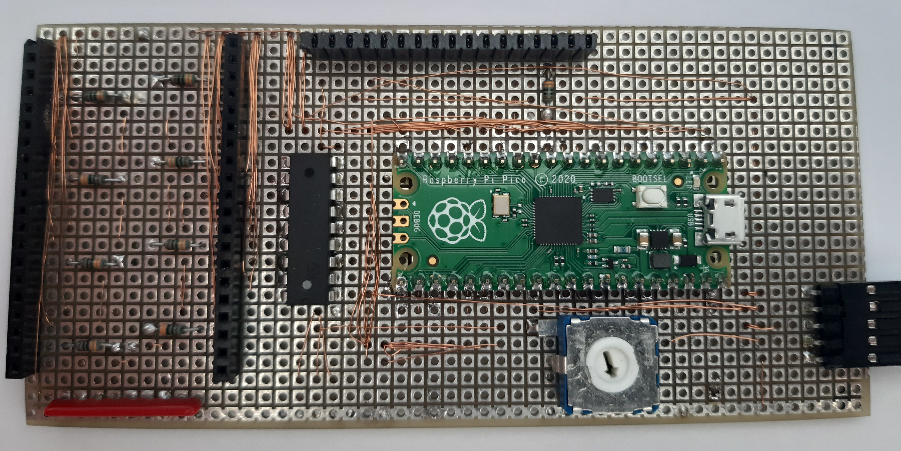
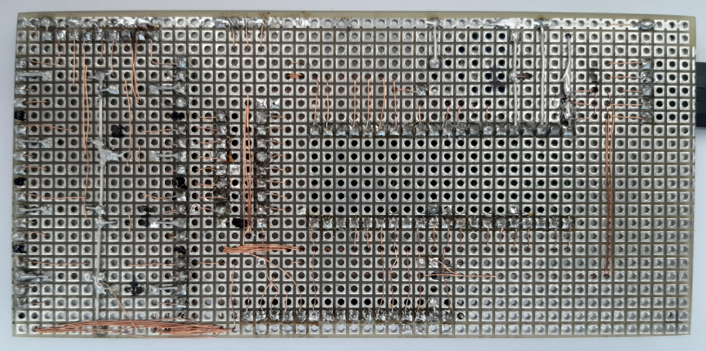

Main PCB
========
The Main PCB contains all parts, except for the push buttons with integrated LED.

I used an Raspberry Pi Pico Module, because there is an existing Firmware Implementation for Klipper which makes the usage very easy.

The DIL-18 IC is an ULN2802A which is used to switch the power over of every controlable peripheral.

LEDs on the ButtonPCB and the Backlight of the LCD Module.

Size
----
* Height
  * 24 Holes
* Width
  * 51 Holes

Top View
--------

Bottom View
-----------
